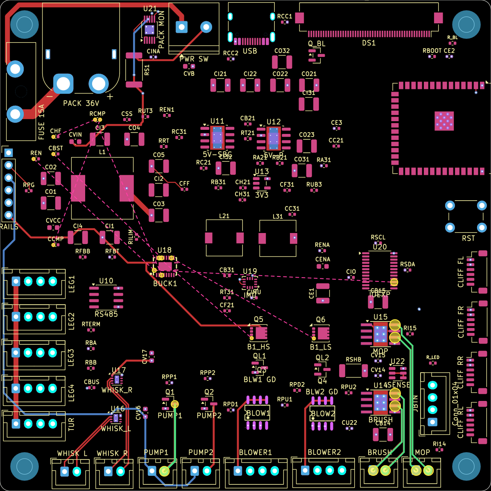

# dg-router

AI-drivable incremental autorouter for KiCad. **Current status: the visual
outline (Milestone 0/0.1) — a KiCad plugin that installs, shows choices, and
previews the selected net highlighted on the board render, live, in-window. It
does not route anything yet.**



## Layout

```
dg_router_plugin/        KiCad Action Plugin (SWIG/pcbnew) — the toolbar button
  __init__.py            registers the plugin
  action_plugin.py       ActionPlugin subclass (thin)
  dialog.py              wx dialog — choices on the left, live net preview on the right
  shim.py                core logic (no wx): list nets, render, net geometry, coord map, emit job
  icon.png               generated toolbar icon
headless.py              trigger the same logic from code (no GUI)
tools/generate_icon.py   regenerates icon.png (pure stdlib)
install.sh               symlink the plugin into KiCad's plugins dir
```

## Install

```
./install.sh
```
Then in KiCad **PCB Editor → Tools → External Plugins → Refresh Plugins**, and
click the **dg-router** button on the toolbar.

- **Click** a net → its pads, existing copper, and an approximate ratsnest
  highlight on the board render (rendered in-process via `wx.svg`, no external
  deps).
- **Check** nets, set prefer-layer / via cost / edge-hug / follow-existing, then
  **Emit job.json** → the interchange the future TS core consumes, written to
  `dg-router-out/` next to the board.
- **Open full SVG** opens the full-resolution render in a browser.

## Headless (trigger from code)

```
KPY=/Applications/KiCad/KiCad.app/Contents/Frameworks/Python.framework/Versions/Current/bin/python3
$KPY headless.py path/to/board.kicad_pcb --list
$KPY headless.py path/to/board.kicad_pcb --render
$KPY headless.py path/to/board.kicad_pcb --route SPI_CLK SPI_MOSI --layer B.Cu --emit
```

## How the highlight lines up

`kicad-cli pcb export svg --page-size-mode 2` plots geometry in **mm** in a
viewBox whose origin is the board plot origin. That origin is the Edge.Cuts
bounding-box center minus half the viewBox size (the viewBox excludes the
~0.05mm/side edge line width the pcbnew bbox includes). So
`svg_mm = pcb_mm − plot_origin`, sub-pixel accurate. Pad/track/via geometry
comes straight from `pcbnew`.

## Routing (headless)

```
$KPY headless.py board.kicad_pcb --route /RT1 /LCD_BL --solve --layer F.Cu
```
Routes each net's DRC gaps with a grid A* on one copper layer, string-pulls the
path to an any-angle polyline, refills zones, and writes tracks to a COPY at
`dg-router-out/routed.kicad_pcb` — never your original board. Reports the
unconnected count before/after; run `kicad-cli pcb drc` to check violations.

## Roadmap

1. ✅ M0 — plugin shim: install, choices, live net-highlight preview
2. ✅ R1 — Python router core: grid A* + string-pull, per-gap routing (so a
   partial net gets completed, not restarted), obstacle costmap, writes to a
   COPY, DRC-verified via kicad-cli
3. DRC-feedback loop: re-route offenders with penalty regions (spec's design)
4. Vias / multi-layer (currently single-layer only)
5. Costmap heatmap + before/after diff renders
6. "Route" button in the plugin (drive from the GUI)
7. Bulk fill pass (tscircuit capacity-mesh, node) for non-critical nets

Router core is **Python + pcbnew** (parse/write for free; `kicad-cli` is the
DRC oracle). A node/tscircuit step comes only for the eventual bulk fill.

## License

MIT
